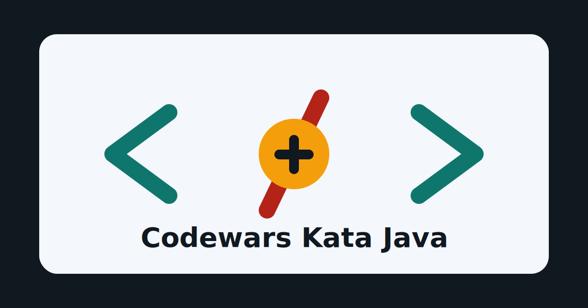

# Java Algorithms & Reliability Showcase

[Русская версия](README.md)

Curated Java reference implementations for deterministic algorithms and stateful validation. The project demonstrates API design, edge-case handling, property-based testing, static analysis, and reproducible CI.

[](https://github.com/krotname/JavaAlgorithmsShowcase/actions/workflows/maven.yml)
[](https://github.com/krotname/JavaAlgorithmsShowcase/actions/workflows/quality.yml)
[](https://github.com/krotname/JavaAlgorithmsShowcase/actions/workflows/codeql-analysis.yml)
[](https://app.codecov.io/gh/krotname/JavaAlgorithmsShowcase)
[](https://securityscorecards.dev/viewer/?uri=github.com/krotname/JavaAlgorithmsShowcase)
[](https://www.bestpractices.dev/projects/13151)
[](LICENSE)
[](https://adoptium.net/)
[](https://junit.org/)
[](https://maven.apache.org/)



## Selected engineering components

| Component | Engineering problem | What it demonstrates |
| --- | --- | --- |
| [Transaction validation](src/main/java/transactions) | Ordered, stateful operations; cascading invalidation; balance and overflow boundaries | Deterministic state transitions, immutable results, integration scenarios |
| [Algorithm utilities](src/main/java/algorithms) | Boundary conditions, complexity, stream and file I/O | Deterministic APIs, explicit complexity tradeoffs, edge cases, and property-based invariants |
| [Parsing / validation](src/main/java/common/SafeParse.java) | Malformed numeric and text input | Explicit contracts, preserved exception causality, unit tests, and static analysis |

This is an engineering demonstration repository, not a commercial product. Implementations are selected to make code quality, test strategy, and the development process directly reviewable.

## Verification strategy

- **Smoke / unit:** baseline contracts for public APIs.
- **Integration:** transaction state and ordering, plus algorithm CLI contracts.
- **Property-based (jqwik):** invariants over broad generated input sets.
- **Static analysis:** Checkstyle, PMD, and SpotBugs with a zero-new-violation baseline.
- **Coverage:** JaCoCo fails `mvn verify` below 70% line, branch, or instruction coverage.
- **Security:** CodeQL, dependency review, and OpenSSF Scorecard.
- **Reproducibility:** Java 17/21 CI and a strict offline Windows gate after Maven cache priming.

## Local verification

```bash
mvn -B verify
mvn -B test -Dgroups='smoke'
mvn -B test -Dgroups='integration'
mvn -B test -Dgroups='property'
mvn -B -DskipTests checkstyle:check pmd:check spotbugs:check
```

Run the complete offline gate in PowerShell:

```powershell
.\scripts\run-offline-gate.ps1
```

See [TESTING.md](TESTING.md) for the complete test matrix and dependency-cache rules.

## Repository map

- `src/main/java/transactions` — stateful validation and its transaction domain model.
- `src/main/java/algorithms` — sorting, graphs, dynamic programming, data structures, and CLI algorithms.
- `src/main/java/common`, `interview`, `leetcode`, `coderun`, `other`, `kyu*` — utilities and implementations with provenance-preserving layout.
- `src/test/java/quality` — entry points for smoke, integration, and property suites.
- `.github/workflows` — CI, quality gates, CodeQL, dependency review, and supply-chain checks.
- [ARCHITECTURE.md](ARCHITECTURE.md), [TESTING.md](TESTING.md), and [SECURITY.md](SECURITY.md) — architecture, test strategy, and security policy.

## Sources & provenance

Problems and APIs come from several sources: Codewars, LeetCode, Yandex algorithm tracks, CodeRun, interview tasks, and standalone exercises. Links to original statements and compatible signatures remain in the code where they help verification.

The `kyu*` packages are retained as internal provenance and compatibility structure. They are not the project's primary taxonomy; the showcase is organized around engineering problems, contracts, and test strategy.
